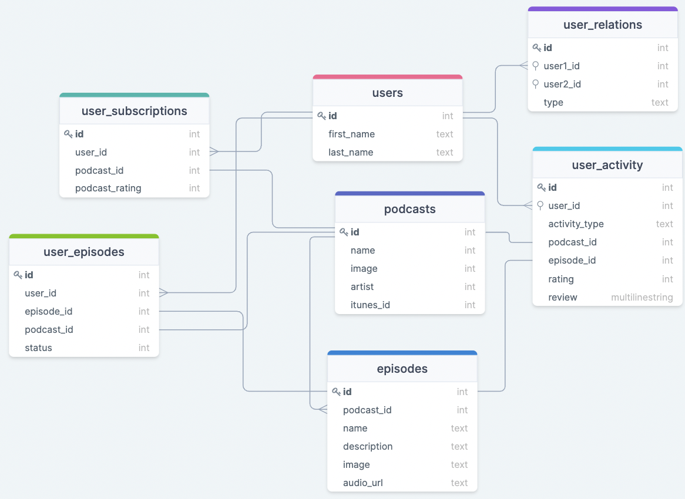

# Podkeeper

The social podcast app - listen, review, and share the podcasts you're listening to. And see what friends are listening to and recommending. 

The frontend is built in React. With a RESTful API backend written in Ruby on Rails. The app is deployed on Heroku: [Podkeeper](http://www.podkeeper.live).

The frontend repo is [here](https://github.com/smh1988-2/podkeeper-fe).

Podkeeper uses jwt and bcrypt for secure signup and login. The app also uses mailers to send an introductory email on signup.

## User Stories

As a user, I can...
* create an account, so I can log in and use the app.
* search for podcasts and subscribe to them.
* listen to an episode of a podcast, with the expected features of a podcast player (play/pause, mute , skip).
* give a x/5 star rating to each episode.
* see a timeline of all the podcast episodes I've listened to or reviewed.
* search for other users and see their activity.

## Models and Relationships



### User

A user has many subscriptions.
A user has many episodes.
A user has many relationships.
A user has many activities.

### Podcasts

A podcast has many episodes.
An episode belongs to a podcast.
A podcast and an episode belong to a user_activity.
A podcast and an episode belong to a user_subscription.
A podcast and an episode belong to a user_episode.


## API

Each table will have multiple endpoints. Here are a few of the important ones:

### POST /users

Creates a new user. Response JSON looks like this:

```json
{ 
  id: 111,
  username: "johndoe",
  firstname: "John",
  lastname: "Doe",
}
```

### POST /user_subscriptions

Creates a new podcast subscription for the user. The data being sent:

```json
{ user_id: 1,
podcast_id: 1,
podcast_rating: null }
```

There is also a DELETE and PATCH endpoint for this table.

### POST /user_activity

Creates a new activity record for the user. The data being sent:

```json
{ user_id: 1,
podcast_id: 1,
episode_id: 1,
rating: 4,
review: "my review is...",
activity_type: "review" }
```
A user can only create new activites and see existing activites. They can't DELETE activities.

## Resources/Attribution
* [iTunes Search API](https://developer.apple.com/library/archive/documentation/AudioVideo/Conceptual/iTuneSearchAPI/index.html#//apple_ref/doc/uid/TP40017632-CH3-SW1)
* [react-spinners](https://www.npmjs.com/package/react-spinners)
* [Bootstrap React](https://react-bootstrap.github.io/)
* [react-player](https://www.npmjs.com/package/react-player)
* [react-icons](https://react-icons.github.io/react-icons/)
* [HTMLemail](https://github.com/leemunroe/responsive-html-email-template)
